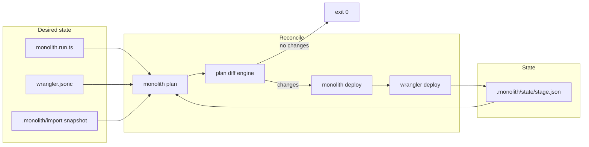

# Architecture

Monolith is a TypeScript IaC layer for Cloudflare Workers. Wrangler remains the deploy engine; Monolith adds desired-state planning, per-stage local state, and typed bindings.

## Packages

| Package | Role |
| --- | --- |
| `@monolith/core` | Stack types, plan diff, state I/O, preview stage helpers |
| `@monolith/cloudflare` | Wrangler import/parse, temp config, Cloudflare API client |
| `@monolith/cli` | `monolith` bin — import, plan, deploy, destroy, test, dev, typegen |
| `create-monolith` | Project scaffold (Hono + D1 + KV template) |

## Reconcile loop

Monolith follows a Terraform-style loop: **desired → plan → apply → state**.

### Desired state resolution (plan)

1. If `monolith.run.ts` exists → parse binding declarations, merge resource IDs from wrangler/import.
2. Else if wrangler config exists → parse wrangler into resources.
3. Else → fall back to latest import snapshot.

### Plan diff

`@monolith/core` compares desired resources to `.monolith/state/<stage>.json` and emits create/update/delete/no-op changes. First run after import typically shows creates or updates.

### Apply (deploy)

`monolith deploy` invokes wrangler as a subprocess. On success, state is updated with `deployedAt` and `workerUrl` parsed from wrangler output.

Preview stages (`pr-*`) write `.monolith/wrangler.<stage>.jsonc` with Worker name suffix before deploy.

### Destroy

Partial teardown: deletes Worker script, clears local state. Shared binding resources (D1/KV/R2) remain in the Cloudflare account by design.

## Stage model

Each stage is an isolated namespace:

- State: `.monolith/state/<stage>.json`
- Preview stages: `pr-<number>` with suffixed Worker name `<base>-pr-<number>`

Production and dev stages use the wrangler config name as-is.

## M1 boundaries

- Local JSON state only (no remote backend)
- Wrangler subprocess for deploy (no direct Workers API deploy in M1)
- No preview SaaS — preview stages are CLI + CI convention

See [product-spec.md](./product-spec.md) for Phase 0–2 roadmap.
