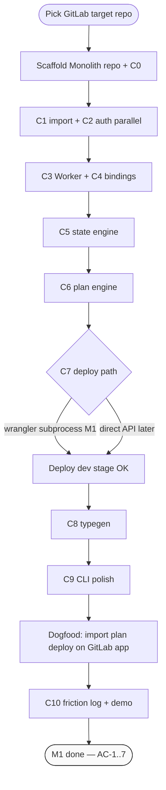
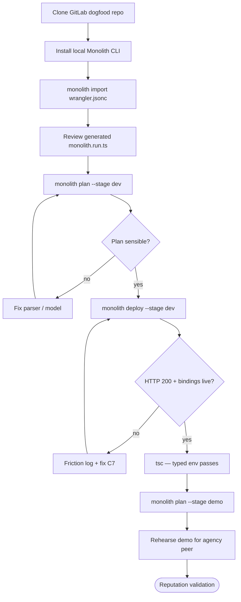

# Monolith / Perch — product spec

**Date:** 2026-06-07  
**Opportunity key:** `perch` · **Product slug:** `perch` · **M1 codename:** `Monolith`  
**Status:** experiment — **not portfolio slot one vs Magpie**  
**Project home:** `/Users/armancharan/work/monolith`  
**Portfolio YAML:** [consignment/data/portfolio/projects/perch.yaml](../../consignment/data/portfolio/projects/perch.yaml)  
**Framework:** [product-selection-thesis.md](../../planning/product-selection-thesis.md) · [paas/dvi-and-layers.md](../../planning/opportunity-intel/portfolio/paas/dvi-and-layers.md)  
**Prior research:** agent transcript `1fdef1b9-a817-4045-9ebd-87c9123cc511` (competitive matrix, full spec, naming, DVI analysis)

---

## What it is

**Perch** is TypeScript infrastructure for Cloudflare teams who have outgrown `wrangler.toml` but do not want Terraform ceremony or Effect lock-in. Define Workers, D1, R2, KV, Queues, and Durable Objects in one typed `perch.run.ts`, get compile-time binding safety, plan/preview/destroy lifecycle, and local dev that matches production — then grow to AWS and Vercel without changing tools. Wrangler-compatible under the hood; Terraform-interoperable at the edges.

**Stack:** TypeScript core (Effect-optional); esbuild + Wrangler bundler adapter; Cloudflare TypeScript SDK; local JSON state (`.perch/state/<stage>.json`); optional `@perch/effect` for Magpie-style teams.

**Elevator pitch:** Where your stack lands — Magpie sits on a perch. CF-wedge IaC with the deploy loop latency SST owns on AWS, but native to Workers.

---

## DVI analysis summary

### Layer 0 mapping

| Layer 0 need | Perch expression |
| --- | --- |
| **Time** | Deploy/debug loop, binding drift, manual env copy-paste |
| **Attention** | Wrangler + TF + dashboard hopping; IAM/binding cognitive load |
| **Coordination** | PR previews, reviewer trust in binding changes |
| **Trust** | "Will this break prod?" — plan/diff, typed bindings |
| **Money** | Engineer $/hour on failed deploys |

Perch is **time + attention + trust** in the deploy graph — devtools, not hosting SaaS.

### Thesis rubric (1–5)

| Axis | Score | Rationale |
| --- | ---: | --- |
| Substrate necessity | **3** | Time/trust/coordination are Layer 0; not as primal as money/health alone. |
| Layer inheritance | **3** → **4** | S1 solo → S2 previews → S3 audit/RBAC; path to **4/5** via previews + PM-on-deploy-records (see §Inheritance roadmap); **unvalidated**. |
| Vector clarity | **5** | TS stack → typed bindings → reliable deploy → team confidence. |
| Alignment | **4** | Shortens deploy time + strengthens audit trail if done right. |
| Inversion risk | **3** | Devtools commoditization; AI/MCP noise could invert attention. |
| AI leverage | **3** | Agent DX (MCP, `AGENTS.md`) is wedge, not core. |
| Operating leverage | **3** | OSS CLI + commercial previews — not services. |
| Vercel fit | **2** | CF-primary; misaligned with thesis "Vercel fit" axis. |
| MRR urgency | **2** | Phase 1 commercial soft launch; no buyer yet. |

**Thesis total (est.):** ~30/45 — experiment shape, not company slot one.

### Portfolio placement (D·V·I 1–5)

| Dimension | Score | Notes |
| --- | ---: | --- |
| **Durability** | **3** | Layer 0 need survives; product unproven; ↑ with wrangler import + durable state. |
| **Vector** | **5** | Primary = **latency** (deploy loop, PR previews); secondary = **quality** (bindings). |
| **Inheritance** | **3** | S1 only until previews prove S1→S2; **→4/5** via previews + PM shell on deploy records (§Inheritance roadmap). |

**Placement read:** `watch` — coherent spread (3/5/3); experiment tier; do not pursue ahead of Magpie.

### Competitive DVI (selected)

| Dimension | Alchemy v2 | **Perch** | SST v3 | Wrangler |
| --- | ---: | ---: | ---: | ---: |
| Durability (thesis) | 3 | **3** | 4 (AWS) | 4 |
| Vector clarity | 5 | **5** | 4 | 3 |
| Layer inheritance | 4 | **3** | 3 | 2 |
| MRR urgency | 1 | **2** | 3 | — |

**Read:** Perch does not beat SST on AWS thesis scores. Win on **CF-specific vector inheritance** (bindings → previews → team audit).

---

## Milestone 1 — specification & composition DAGs

**Confirmed:** 2026-06-07 — first validation target is one small GitLab-hosted project (design partner #1 = yourself). **Positioning:** B2D / agency devtools — reputation-first, not Vercel-adjacent hosting or Canva-style creative tooling.

**Codename for M1 build:** **Monolith** (`monolith.run.ts`, `monolith import|plan|deploy`). Portfolio memo and YAML stay **Perch** until M1 demo proves the wedge; rename or dual-brand only after friction log.

### 1. Milestone contract (formal spec)

| Field | Value |
| --- | --- |
| **ID** | `M1-GITLAB-DOGFOOD` |
| **Name** | GitLab dogfood — import → plan → deploy → typed bindings |
| **Owner** | Founder (design partner #1 = self) |
| **Target repo profile** | One **small GitLab-hosted** TS Worker app (private OK): existing `wrangler.toml` or `wrangler.jsonc`; **≥2 bindings** from {D1, R2, KV, Queue, DO}; **≥2 stages** worth modeling (e.g. `dev` + `demo` or `dev` + `prod`); single Worker entry + Hono or plain fetch handler; no Pages, no multi-account; fits **≤40h** capped calendar |

**Preconditions**

- Cloudflare account with API token or OAuth app scoped for Workers + chosen binding types on target zone/account.
- Target GitLab repo cloned locally; `wrangler deploy` already succeeds on at least one stage (baseline truth).
- Monolith repo (local only — **no public npm/org** until M1 postconditions met).
- `.env` or shell holds `CLOUDFLARE_API_TOKEN` (or OAuth refresh) — not committed.

**Postconditions / acceptance criteria (all must pass)**

| # | Criterion | Test |
| ---: | --- | --- |
| AC-1 | `monolith import wrangler.jsonc` (or `.toml`) produces valid `monolith.run.ts` + `.monolith/state/<stage>.json` skeleton without hand-editing handler | Import exit 0; file parses; resources match wrangler bindings |
| AC-2 | `monolith plan --stage dev` shows **meaningful** diff vs last apply (create/update/no-op — not empty noise) | Plan output lists ≥1 resource change on first run; stable on re-plan after deploy |
| AC-3 | `monolith deploy --stage dev` succeeds; Worker serves HTTP 200 on configured route | `curl` smoke + CF dashboard shows expected script version |
| AC-4 | Handler `env` is **typed** from `monolith.run.ts` — no hand-maintained `Env` interface | `tsc --noEmit` passes; binding keys match runtime |
| AC-5 | Second stage (`demo` or `prod`) at minimum **plans** without corrupting `dev` state | Separate state file per stage; plan scoped to `--stage` |
| AC-6 | **Friction log** in [milestone-1.md](./milestone-1.md): ≥3 bullets each for worked / failed / next | Section exists before M1 marked done |
| AC-7 | **Demo script** (5–10 min) rehearsed — you would show migration to **one agency peer** | Script in repo or doc; covers import → plan → deploy → types |

**Non-goals (M1)**

- npm publish, GitHub org, community launch, Product Hunt
- Perch Cloud / preview SaaS / paid tiers
- Full GitLab CI template (optional stub only — see appendix)
- Second external design partner
- `destroy`, `dev` watch mode, remote state, PR previews
- AWS / multi-cloud, `@monolith/effect`, Terraform export
- Resource types beyond what target repo uses + Worker shell

**Artifacts produced**

| Artifact | Location |
| --- | --- |
| `monolith.run.ts` | Target GitLab repo (or local fork) |
| `.monolith/state/<stage>.json` | Local state (gitignored) |
| Plan/deploy logs | `docs/m1-run-log.txt` or friction log excerpts |
| Friction log | [milestone-1.md](./milestone-1.md) |
| Demo script | `docs/m1-demo.md` |
| Tool source | `~/work/monolith` (private until M1 done) |
| Optional CI stub | `.gitlab-ci.yml` comment skeleton (appendix) |

**Success metrics (reputation play)**

- **Not** GitHub stars, npm downloads, or HN upvotes
- **Yes:** demo-ready migration story; counts as **1 design-partner deploy** toward Week-12 gate (`>10` deploys path)

#### §M1 friction log

Active log: [milestone-1.md](./milestone-1.md#friction-log).

---

### 2. Technical spec — composable capabilities

Minimal **nodes** for M1. Each must be verifiable in isolation before composition.

| ID | Capability | Input → Output | Depends on | Verification | Size |
| --- | --- | --- | --- | --- | ---: |
| **C0** | Project scaffold / `monolith.run.ts` shell | CLI `init` → runnable TS module exporting default async stack handler | — | Empty stack compiles; CLI `--help` lists commands | **S** |
| **C1** | Wrangler config parser (import) | `wrangler.toml\|jsonc` → internal `StackManifest` | C0 | Golden-file tests on sample wrangler configs; round-trip binding names | **M** |
| **C2** | CF API client + auth | Token/OAuth env → authenticated `fetch` to CF REST | C0 | `GET /accounts/{id}` returns 200 in integration test (mock OK for unit) | **M** |
| **C3** | Resource model: **Worker** | Manifest + state → `WorkerResource` (name, script, routes, compatibility) | C1, C2 | Schema validates; plan produces Worker diff | **M** |
| **C4** | Resource model: **bindings** (subset) | Manifest → D1 / R2 / KV / Queue / DO binding descriptors | C1, C3 | Import extracts ≥2 binding types from dogfood wrangler file | **L** |
| **C5** | State engine (local JSON) | R/W `.monolith/state/<stage>.json` | C3 | Read after write; stage isolation test | **S** |
| **C6** | Plan / diff engine | Desired (run.ts) + state → human plan + machine diff | C3, C4, C5 | First plan shows creates; second shows no-op or update | **M** |
| **C7** | Deploy / reconcile | Plan diff → Worker live + bindings attached | C2, C3, C4, C5, C6 | Deploy exit 0; CF dashboard matches; wrangler-equivalent route | **L** |
| **C8** | Typegen: inferred handler `env` | Stack bindings → `.d.ts` or inline generic on handler | C3, C4 | `tsc --noEmit` on dogfood handler without manual `Env` | **M** |
| **C9** | CLI: `init`, `import`, `plan`, `deploy` | argv + cwd → side effects | C0–C8 | End-to-end script: import → plan → deploy on fixture project | **M** |
| **C10** | GitLab friction log + demo script | M1 run notes → doc + rehearsed peer demo | C9 | AC-6, AC-7 satisfied | **S** |

**M1 binding subset:** implement only types present in target repo **plus** Worker shell. Do not build full Tier-1 matrix from Phase 0 until second dogfood app.

---

### 3. Composition DAGs (mermaid)

#### DAG A — Capability dependency graph

```mermaid
graph TD
  C0[C0 Scaffold / monolith.run.ts shell]
  C1[C1 Wrangler import parser]
  C2[C2 CF API client + auth]
  C3[C3 Worker resource model]
  C4[C4 Bindings resource model]
  C5[C5 Local JSON state engine]
  C6[C6 Plan / diff engine]
  C7[C7 Deploy / reconcile]
  C8[C8 Typegen inferred env]
  C9[C9 CLI init import plan deploy]
  C10[C10 Friction log + demo script]

  C0 --> C1
  C0 --> C2
  C0 --> C5
  C1 --> C3
  C1 --> C4
  C2 --> C3
  C2 --> C7
  C3 --> C4
  C3 --> C5
  C3 --> C6
  C4 --> C6
  C4 --> C7
  C4 --> C8
  C5 --> C6
  C5 --> C7
  C6 --> C7
  C3 --> C8
  C7 --> C9
  C8 --> C9
  C9 --> C10
```



#### DAG B — Execution sequence (critical path to M1 done)



#### DAG C — User journey (developer actions)



---

### 4. Critical path & parallel tracks

**Critical path (sequential):** C0 → C1+C2 → C3+C4 → C5 → C6 → C7 → C8 → C9 → dogfood run → C10.

**Parallel after C0 (week 1):**

| Track A | Track B |
| --- | --- |
| C1 wrangler parser + golden tests | C2 auth + CF client smoke |
| C5 state R/W | C0 CLI skeleton |

**Parallel after C3 exists (week 2):**

| Track A | Track B |
| --- | --- |
| C6 plan engine | C8 typegen (needs binding schema only) |
| C7 deploy (wrangler adapter first) | — |

**Suggested 3-week cap (optional)**

| Week | Focus | Exit |
| --- | --- | --- |
| **1** | C0, C1, C2, C5; pick GitLab repo; import produces manifest | Import exit 0 on real wrangler file |
| **2** | C3, C4, C6, C7 (dev stage deploy via wrangler subprocess) | AC-3 on dev |
| **3** | C8, C9, second-stage plan, C10 friction log + demo | AC-1..7 green |

Calendar cap aligns with portfolio rule: do not steal >15% Magpie time — if week 2 slips, cut second stage to **plan-only** (AC-5 relaxed to plan-only, deploy stays dev-only).

---

### 5. Decision points (M1 speed defaults)

| Decision | Options | **M1 recommendation** | Rationale |
| --- | --- | --- | --- |
| Deploy engine | Wrap Wrangler vs direct CF API | **Wrangler subprocess** for bundle + deploy | Wrangler already proves bundle + binding attachment on dogfood repo; direct API is Phase 0 stretch |
| CF control plane | Subprocess vs `@cloudflare/cloudflare-typescript` | **Hybrid:** C2 direct API for read/plan metadata; **C7 deploy via `wrangler deploy`** | Plan/diff needs resource IDs from API; deploy reuses battle-tested bundler |
| `monolith.run.ts` API | Async-first vs Effect-native | **Async-first** default export; Effect optional later | Matches build-vs-fork thesis; 10–50× addressable TS devs |
| State | Local JSON vs remote | **Local JSON only** | M1 non-goal; `.monolith/state/<stage>.json` gitignored |
| Import source | toml vs jsonc | **Support both;** dogfood file wins | Match target repo exactly |
| Brand in repo | Monolith vs Perch | **Monolith** in CLI UX and filenames for M1 demo | Agency/devtools gravitas; Perch stays portfolio id |

**Revisit after M1:** if wrangler subprocess hides plan-relevant drift, promote direct API deploy for C7 in Phase 0 week 4+.

---

### 6. Verification checklist

Copy when marking M1 done:

```markdown
## M1 verification — M1-GITLAB-DOGFOOD

- [ ] AC-1: `monolith import` on GitLab repo wrangler config → valid `monolith.run.ts` (no hand fix)
- [ ] AC-2: `monolith plan --stage dev` shows meaningful first-run diff
- [ ] AC-3: `monolith deploy --stage dev` → HTTP 200 smoke on configured route
- [ ] AC-4: Handler env typed; `tsc --noEmit` clean without manual `Env`
- [ ] AC-5: `monolith plan --stage <second>` uses isolated state (plan OK)
- [ ] AC-6: Friction log in [milestone-1.md](./milestone-1.md) filled (≥3 worked / failed / next)
- [ ] AC-7: `docs/m1-demo.md` rehearsed — willing to show one agency peer
- [ ] Non-goals respected: no npm publish, no second user, no preview SaaS
- [ ] Week-12 metric: logged as 1 design-partner deploy
```

---

### Appendix — GitLab CI stub (M2-oriented, not required for M1)

Skeleton only — do not wire until M1 done:

```yaml
# .gitlab-ci.yml — Monolith/Perch (enable post-M1)
# stages: [plan, deploy]
#
# plan_on_mr:
#   stage: plan
#   rules: [if: $CI_PIPELINE_SOURCE == "merge_request_event"]
#   script:
#     - npx @monolith/cli plan --stage dev
#
# deploy_main:
#   stage: deploy
#   rules: [if: $CI_COMMIT_BRANCH == $CI_DEFAULT_BRANCH]
#   script:
#     - npx @monolith/cli deploy --stage dev
#   when: manual
```

---

## Phase 0–2 spec (condensed)

### Phase 0 (0–3 months) — CF depth

**IN**

```bash
perch init | plan | deploy | destroy | dev | import wrangler.json | state show|pull|push
```

**Resources (Tier 1):** Worker, D1Database, R2Bucket, KVNamespace, Queue, DurableObjectNamespace (automated two-step migration), Secret/SecretStore, WorkersRoute/CustomDomain.

**Workflows:** Single `perch.run.ts`; stage = namespace prefix; async handler default; `@perch/effect` optional; GitHub Action template (plan on PR, deploy on merge).

**DX targets:** `npx create-perch` → Hono + D1 todo deploys in <5 min; import wrangler.json without rewriting handlers.

**OUT:** SaaS console, AWS/Azure/GCP, RBAC, drift, Pages (use Worker + Static Assets first), WfP, AI Gateway/Vectorize/Hyperdrive, TF state import, paid tiers.

### Phase 1 (3–9 months) — deepen CF + previews

**Resources (Tier 2):** StaticAssets, PagesProject, Hyperdrive, Vectorize, AI/AI Gateway, AnalyticsEngine, DNSRecord/Zone.

**Framework plugins:** `@perch/hono`, `@perch/next-on-cf`, `@perch/remix-cf`.

**Workflow:** `perch deploy --preview` + PR comment; `perch watch`; remote state (R2/S3); `perch.tf` export for hybrid TF.

**Commercial soft launch:** Perch Cloud free (3 previews) → Pro ($29–49/seat).

### Phase 2 (9–18 months) — hybrid multi-cloud

**Providers:** `@perch/aws` (minimal), `@perch/vercel`, `@perch/stripe`.

**Platform:** Team RBAC, drift detection, Pulumi/TF import, self-hosted Perch Cloud.

**Guard:** Phase 2 only if Phase 1 previews validate S1→S2 inheritance. Multi-cloud before previews = inverted growth.

---

## Inheritance roadmap (PM · publish-through-product)

### Framework context

Same Layer 0 need — **time, trust, coordination** — repeats solo → team → org without repositioning. **PM must be coordination on deploy records**, not a second product. Every future PM screen is a view on durable deploy artifacts (preview URLs, plan diffs, deploy events), not a parallel publish pipeline.

### Easy / high leverage (before own PM)

| Capability | Inheritance read |
| --- | --- |
| Publish = deploy | `perch deploy --stage X` under the hood — no bypass of `perch plan` |
| Preview URLs as coordination artifacts | PR preview, stage URL, plan diff on tickets — durable first-class objects |
| Webhooks before building PM | deploy/plan events → Linear / GitHub / Slack |
| Templates with lineage | `create-perch --from template/...` |
| Roles on same graph | Reviewer approves plan; PM triggers stage deploy only |

### Worthwhile medium effort (Phase 1–2)

- **Project = stage namespace** — thin shell over existing stage model
- **Publish queue for non-devs** — gated deploy, child invocation
- **Client/agency inheritance** — template → client project → preview → prod

### Skip / breaks inheritance

| Anti-pattern | Why |
| --- | --- |
| Full PM before Phase 0 holy trinity | import, bindings, plan must exist first |
| PM as separate hosting/CMS product | Inverts Perch into hosting SaaS |
| Publish path bypassing `perch plan` | Breaks trust + audit trail |
| Custom CMS before durable deploy graph | Parallel pipeline, not inheritance |

### Long-run shape

```
perch.run.ts → stages/previews → PM shell (who/when/stage/approve) → Publish = deploy
```

### Practical phase order

| Phase | Scope |
| --- | --- |
| **0** | import, bindings, plan |
| **1** | previews, webhooks, templates |
| **1.5** | thin Projects UI (stages + publish button) |
| **2** | RBAC, audit, agency multi-tenant |
| **3** | full PM only if S2 inheritance validated |

**Key principle:** Preview URLs + deploy events as first-class durable artifacts; every future PM screen is a view on those, not a parallel publish pipeline.

---

## Competitive positioning

| vs | Perch angle |
| --- | --- |
| **Alchemy v2** | Effect-optional; stability contract; Wrangler-native bundler; wrangler import; CF API depth (DO migrations, Pages). Don't fork — steal binding patterns. |
| **SST v3** | CF-first vs AWS-first; deeper Workers/D1/R2/KV/DO; no Pulumi/Terraform bridge weight for CF-only teams. |
| **Pulumi/Terraform** | App-developer DX; typed bindings; integrated dev loop; honest hybrid (TF at edges, Perch for Workers). |
| **Wrangler** | Composable IaC; plan/destroy; multi-env state; PR previews; compile-time binding safety. |

**Core insight:** CF docs recommend hybrid Wrangler + TF. No tool owns that story with good DX.

---

## Build vs fork

**Recommendation: build new, don't fork Alchemy.**

| Factor | Fork Alchemy | Build Perch |
| --- | --- | --- |
| License | Apache 2.0 — legal but upstream coupling | Clean IP, brand ownership |
| Architecture | Effect-native core — fighting it hurts market | Async-first fits 10–50× more TS devs |
| Brand | Generic; crowded trademark | Perch/Plinth in Magpie family |
| Differentiation | "Alchemy but…" | Greenfield CF wedge |

**Steal (don't fork):** Binding.Service/Policy split; compile-time provider wiring; stack-as-default-export; agent-friendly docs.

**Exception:** If Alchemy team aligns on Effect-optional + CF wedge, **partnership > fork**.

---

## Naming

| Rank | Name | Fit | Notes |
| ---: | --- | --- | --- |
| **1** | **Monolith** | ★★★★★ Agency/devtools gravitas; 2001 metaphor | CLI natural (`monolith deploy`); `monolith.run.ts`; **M1 leading candidate** |
| **2** | **Perch** | ★★★★★ Magpie family metaphor | Portfolio + memo codename; CLI natural (`perch deploy`); multi-cloud safe |
| **3** | **Plinth** | ★★★★★ Ownable; Substrate-adjacent | Backup if primary domains/npm blocked; spelling friction |
| **4** | **Bindstack** | ★★★☆☆ Vector-clarity SEO | Colder brand; `-stack` crowded |

**DVI pick (2026-06-07):** **Monolith** for M1 dogfood + agency reputation play (B2D, not Vercel/Canva-adjacent). **Perch** if Magpie-family brand compounds matter more post-M1. **Plinth** if domains/npm blocked.

**Availability sketch (2026-06-07):** see §Domain/npm/trademark checks below and portfolio review notes in [perch.yaml](../../consignment/data/portfolio/projects/perch.yaml).

---

## GTM wedge

**Positioning:** B2D / agency devtools — reputation-first validation (credible migration demo for one peer), not Vercel-adjacent hosting or Canva-style creative tooling. M1 optimizes for **design-partner deploy count**, not GitHub stars or npm downloads.

**Primary vector:** `latency` — deploy loop + PR previews.  
**Wedge ladder:**

| Feature | Layer 0 | System | DVI tags |
| --- | --- | --- | --- |
| Typed bindings | Trust, attention | S1 | `durable` + `quality` + `root` |
| wrangler import | Time (migration) | S1 | `durable` state + `latency` |
| PR previews | Coordination, trust | S1→S2 | `child` + `latency` |

**Channels (ordered):** OSS CLI + `create-perch` → content ("Why TF fails for CF Workers") → CF/Hono community → Effect Discord (`@perch/effect`, don't attack Alchemy) → Hono/Drizzle example apps → PH/HN after 10 design partners.

**First 100 users (target mix):** 30 content/SEO, 25 CF/Hono community, 20 personal network, 15 agent discovery, 10 HN/PH.

**Monetization:** Don't paywall core deploy. Paid wedge = preview environments + shared state + audit log (SST Console / Vercel playbook).

---

## Kill rules

### Week 12 (product)

| Signal | Action |
| --- | --- |
| <50 stars **AND** <10 design-partner deploys | **Kill** — no market pull |
| >30% bounce at CF OAuth | Fix auth UX; extend 4 weeks |
| Alchemy 1.0 + wrangler import + no Effect required | Reassess differentiation |
| CF announces native "Stacks" | Partnership or kill |
| 3+ paying Cloud Pro | **Continue** — commercial validation |
| Community PRs from non-founders | **Continue** — ecosystem forming |

### Portfolio-level

| Signal | Action |
| --- | --- |
| Steals >15% calendar from Magpie without MRR path | **Kill** — Layer 0 inversion (your time/attention) |
| Zero unprompted time/trust/coordination words in 8 interviews | **Kill** per wedge discovery pattern |

---

## Portfolio relationship to Magpie

| Dimension | Magpie | Perch |
| --- | --- | --- |
| **Slot** | Portfolio slot one — active product | Experiment — ideation only |
| **MRR urgency** | 3→4 | 2 |
| **Synergy** | `@perch/effect` can dogfood Magpie Effect patterns; Perch could deploy Magpie CF surfaces | |
| **Conflict** | Calendar competition; both are TS/Effect-adjacent | Cap Perch time until Magpie pilot signal |
| **Kill coupling** | Magpie wins if Perch Week-12 kills | Perch wins only if design partners + optional Cloud Pro without starving Magpie GTM |

**Bottom line:** Magpie remains higher MRR-urgency bet. Perch is thesis-coherent devtools experiment — pursue only if Week-12 inheritance evidence (design-partner deploys) fires without portfolio inversion.

---

## Domain / npm / trademark checks (2026-06-07)

| Asset | Perch (primary) | Plinth (backup) |
| --- | --- | --- |
| `npm` unscoped | **Taken** — `perch@1.0.0` (bang88, ISC) | **Taken** — `plinth@0.0.2` (deprecated gulp lib) |
| `@*/cli` | **Available** — 404 | **Available** — 404 |
| `@*/cloudflare` | **Available** — 404 | N/A (use `@plinth/cloudflare` if pivot) |
| GitHub `*-dev` | **Taken** — `perch-dev` user (1 repo) | **Taken** — `plinth-dev` org |
| GitHub `*stack` | **Available** — 404 | **Available** — 404 |
| `*.dev` | **Taken** — perch.dev, plinth.dev (ACTIVE) | same |
| `*.run` | **Taken** — perch.run, plinth.run (ACTIVE) | same |
| `*.sh` | **Taken** — perch.sh (Gandi) | — |
| `getperch.com` | **Taken** — parked (GoDaddy/Afternic) | — |

**Implications**

- Use **scoped packages** (`@perch/cli`, `@perch/cloudflare`) — unscoped `perch` unavailable.
- GitHub org likely **`perchstack`** or **`plinthstack`** (both 404 at check time) — not `perch-dev` / `plinth-dev`.
- Primary domains blocked — budget for acquisition or compound names (`perchstack.dev`, `useperch.dev`, `onperch.dev`) before marketing spend.
- **`@perch-framework/*`** exists (2018) — avoid confusion; do not use `@perch-framework` scope.
- **`perch-ts`** published 2026-06-03 — monitor collision.

**Trademark:** Informal check only. **Formal IP Australia (class 42) + USPTO (class 9/42) search required** before paid marketing. Known collisions: Perch Analytics, Perch HQ, generic "perch" SEO noise.

---

## Next actions

1. **M1:** Pick one small GitLab project meeting §Milestone 1 target repo profile; run import → plan → `deploy --stage dev`; fill §M1 friction log; complete §6 verification checklist.
2. **Do not scaffold public repo** until M1 deploy proven or explicit calendar allocation beyond dogfood cap.
3. If proceeding beyond M1: `monolith import wrangler.json` / `perch import wrangler.json` on chosen dogfood app.
4. Append consignment review after M1: `pnpm portfolio:review perch --durability 3 --vector 5 --inheritance 3 --notes "M1 GitLab dogfood …"`.
5. Re-run domain/npm checks before public launch; file trademark search (Monolith + Perch + Plinth).
6. Fill M1 friction log in [docs/milestone-1.md](./milestone-1.md) during execution.

---

## Changelog

| Date | Note |
| --- | --- |
| 2026-06-07 | Initial memo promoted from Perch/Alchemy research thread; perch.yaml registered in consignment portfolio |
| 2026-06-07 | Added §Inheritance roadmap (PM · publish-through-product); DVI inheritance notes →4/5 path via previews + PM-on-deploy-records |
| 2026-06-07 | Confirmed **Milestone 1 — GitLab dogfood** (design partner #1 = self); Monolith leading codename; B2D/agency reputation-first positioning; GitLab CI stub appendix |
| 2026-06-07 | Added **§Milestone 1 — specification & composition DAGs** — formal contract (AC-1..7), C0–C10 capabilities, 3 mermaid DAGs, critical path, M1 decision defaults, verification checklist |
| 2026-06-07 | Canonical spec moved to `~/work/monolith/docs/product-spec.md`; planning path is stub redirect |
